DM_HT_COVID19
================
Oscar J. Ponce & Francisco Barrera
5/2/2020

<i>Analysis and visualization developed by [Oscar J.
Ponce](https://twitter.com/PonceOJ) and [Francisco J.
Barrera](https://twitter.com/barrera_md)</i>

## Publication

*Article was published in 2020. To know more about the methodology,
results and conclusion of this study follow the link below.*

| Title   | [Prevalence of Diabetes and Hypertension and Their Associated Risks for Poor Outcomes in Covid-19 Patients](https://doi.org/10.1210/jendso/bvaa102) |
|:--------|:----------------------------------------------------------------------------------------------------------------------------------------------------|
| Journal | Journal of the Endocrine Society                                                                                                                    |

## Data cleaning & Databases information

Data was cleaned via RStudio. All databases are found in the file named
“Databases” located in the github projected called “DM_HT_COVID19”.

To perform this analysis, four databases were used:

1.  **general_info**: contains ID and real author names with RoB
    results.
2.  **proportions**: contains data needed to perform meta-analysis of
    proportions.
3.  **effectsize**: contains data neded to calculate meta-analysis of
    relative risks.
4.  **unimulti**: contains reported univaraite or multivariate analysis
    of our exposure and outcomes of interest.

Packages used to develop forest plots:

1.  **forestplot**:
    <https://cran.r-project.org/web/packages/forestplot/forestplot.pdf>
2.  **metafor**: <http://www.metafor-project.org/doku.php>

## Proportions - summary of forest plots

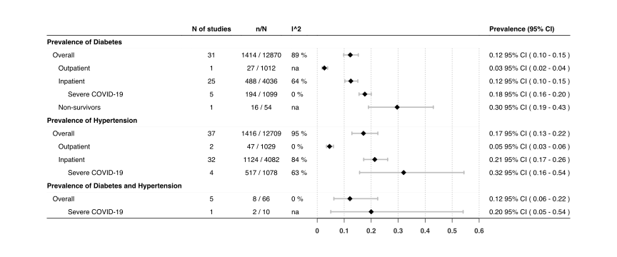<!-- -->

## Proportions - individual forest plots

> Abbreviations of all individvual graphs:
>
> -   n = number of events
> -   N = population size
> -   CI = confidence interval

**Suppl Figure 1 - Forest plot of meta-analysis of DM frequency in
patients with COVID-19**
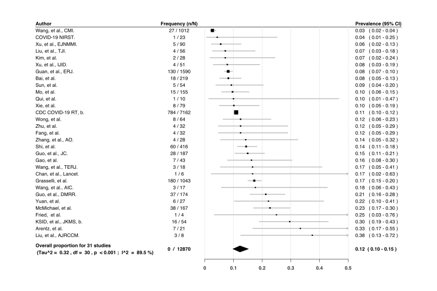<!-- -->

**Suppl Figure 2 - Forest plot of meta-analysis of DM frequency in
hospitalized patients with COVID-19**
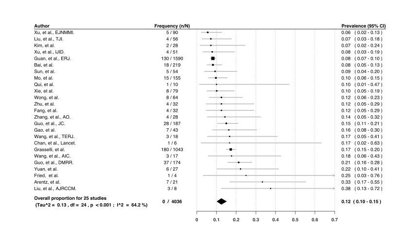<!-- -->

**Suppl Figure 3 - Forest plot of meta-analysis of DM frequency in
patients with severe COVID-19**
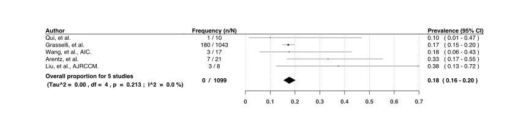<!-- -->

**Suppl Figure 4 - Forest plot of meta-analysis of HT frequency in
patients with COVID-19**
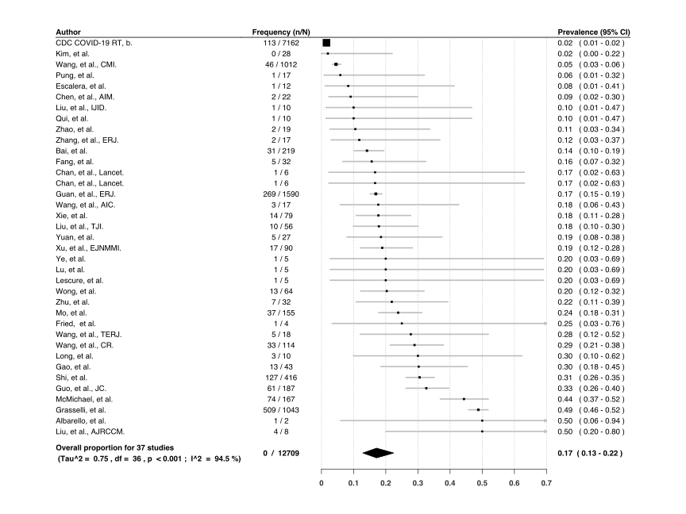<!-- -->

**Suppl Figure 5 - Forest plot of meta-analysis of HT frequency in
ambulatory patients with COVID-19**
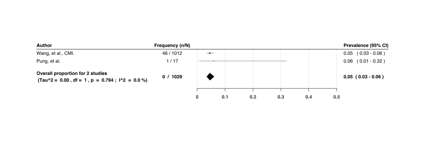<!-- -->

**Suppl Figure 6 - Forest plot of meta-analysis of HT frequency in
hospitalized patients with COVID-19**
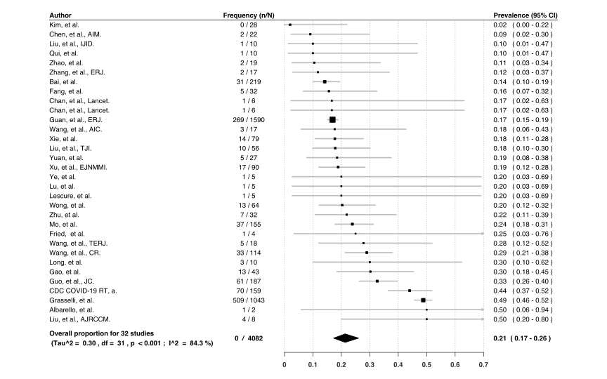<!-- -->

**Suppl Figure 7 - Forest plot of meta-analysis of HT frequency in
patients with severe COVID-19**
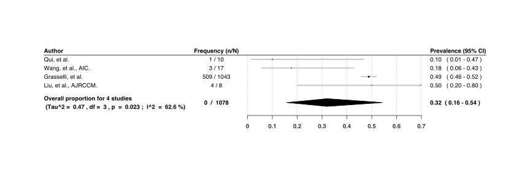<!-- -->

**Suppl Figure 8 - Forest plot of meta-analysis of HT and DM frequency
in patients with COVID-19**
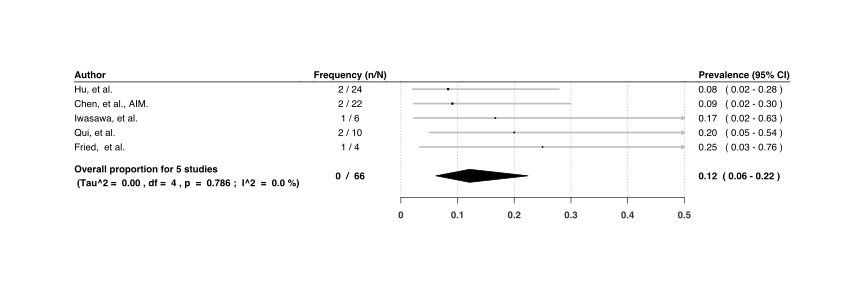<!-- -->

## Effect sizes - summary of forest plots

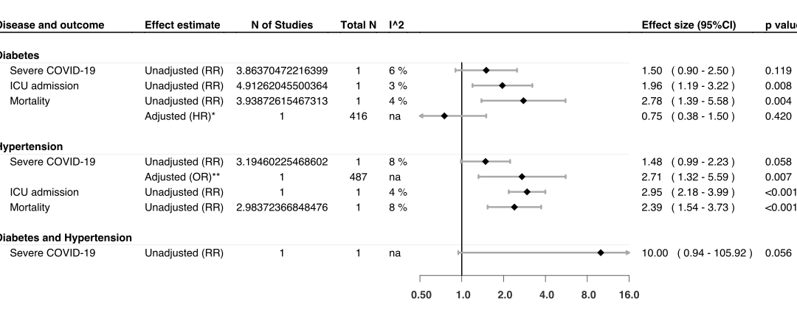<!-- --><!-- -->

## Relative risks - individual forest plots

> Abbreviations of all individvual graphs:
>
> -   n = number of people who developed the events
> -   N = population size
> -   CI = confidence interval

**Suppl Figure 9 - Risk of developing severe COVID19 in patients with
DM** 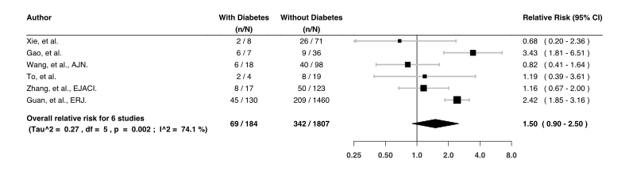<!-- -->

**Suppl Figure 10 - Risk of being admitted to ICU in patients with
COVID19 and DM** 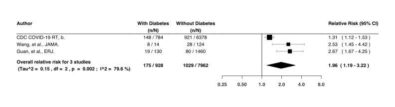<!-- -->

**Suppl Figure 11 - Risk of dying in patients with COVID19 and DM**
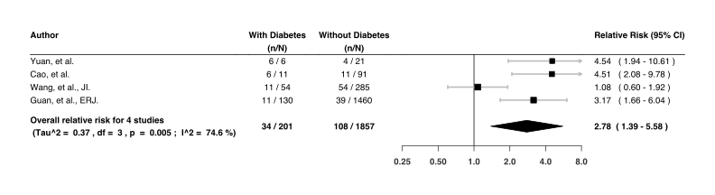<!-- -->

**Suppl Figure 12 - Risk of developing severe COVID19 in patients with
HT** 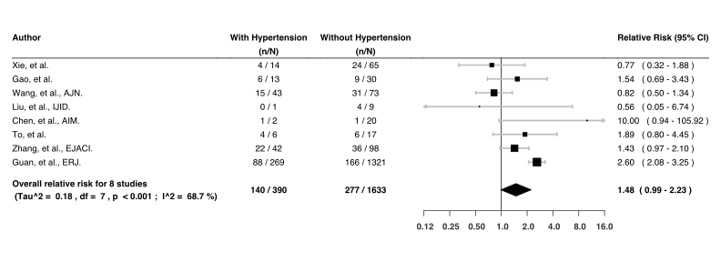<!-- -->

**Suppl Figure 13 - Risk of being admitted to ICU in patients with
COVID19 and HT** 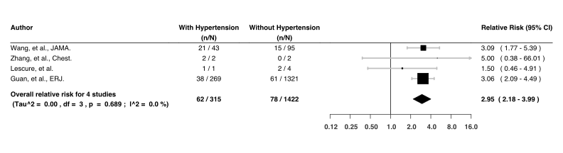<!-- -->

**Suppl Figure 14 - Risk of dying in patients with COVID19 and HT**
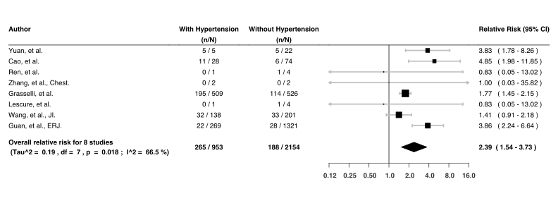<!-- -->
